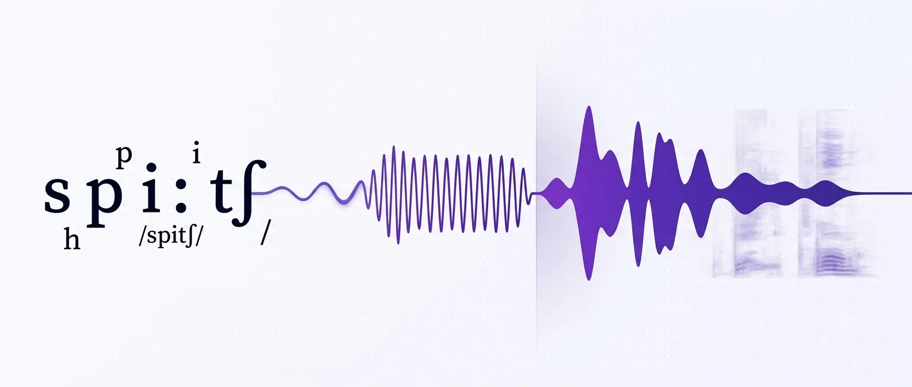

<picture>
<source media="(prefers-color-scheme: dark)" srcset="docs/assets/banner-dark.webp">
<source media="(prefers-color-scheme: light)" srcset="docs/assets/banner-light.webp">

</picture>

**A curated, developer-friendly path through text-to-speech, organized around the one decision that shapes every other: real-time streaming synthesis for agents versus high-fidelity offline synthesis for media.**

Text-to-speech split into two fields wearing one name. One is **real-time synthesis**, judged by time-to-first-byte and measured in milliseconds, where a voice agent has to start speaking before the caller notices a gap. The other is **offline synthesis**, judged by naturalness and expressive range, where an audiobook or a dub can take all the compute it wants. A model that wins one loses the other, and almost every mistake in a TTS build traces back to picking a tool tuned for the wrong side of that line.

This list is organized so that split stays visible everywhere. Providers, models, and benchmarks each carry a real-time or offline lean, and the sections that matter most to agent builders, streaming, cancellation, and codecs, are the ones the rest of the field explains worst.

Learning resources are tagged **🟢 Beginner**, **🟡 Intermediate**, or **🔴 Advanced**. Prefer free official docs and vendor-neutral guides; where an author has a commercial interest, it is flagged.

---

## How to use this list

Read top-to-bottom if you are new to synthesis. The recommended path:

1. **Foundations** understand the front-end, acoustic model, and vocoder split, and why streaming changes all three.
2. **Pick a side** decide real-time or offline for your use case, then choose a provider or open model from the matching column.
3. **Streaming** if you are building agents, this is the section that matters. First-byte latency, cancellation, chunking.
4. **Expressivity and cloning** control emotion, style, and speaker identity once the basics stream cleanly.
5. **Evaluation** learn to measure your own traffic, because vendor benchmarks are tuned to flatter the vendor.

---

## Scope

**In scope.** Everything that turns text into a waveform: the front-end (text normalization, grapheme-to-phoneme, prosody prediction), acoustic models, neural vocoders and audio codecs, streaming and cancellation, voice cloning and voice design, expressive and multilingual control, and the evaluation and ethics that any serious deployment now requires.

**Out of scope.** Speech-to-text, voice activity detection, turn detection and endpointing, transport (WebRTC), and telephony (SIP) all belong to the pipeline, not to synthesis. Where a TTS decision depends on one of them, this list explains just enough to make that decision and no more. Turn detection is the clearest case: cancelling synthesis on a barge-in is a TTS concern and lives in Section 4, but deciding that a barge-in happened is a turn-taking concern that sits outside this list.

**The boundary cases, and how they are handled.** Voice cloning and voice conversion are treated as core TTS and included, scoped to synthesis rather than to speaker verification. Watermarking and cloning ethics stay in, because in 2026 they are inseparable from shipping a synthetic voice. Music and general audio generation stay out.

**The inclusion bar.** A resource earns a place if it is active within the last 12 months, accessible to a working developer, and either vendor-neutral or clearly labeled when authored by a commercial party. A provider earns a row if you can send it text and get back audio today, not on a waitlist.

---

## Table of contents

<b>📖 Expand the 17 sections</b>

1. [Foundational concepts](#-1-foundational-concepts)
2. [Commercial providers](#-2-commercial-providers)
3. [Open-source and open-weight models](#-3-open-source-and-open-weight-models)
4. [Streaming and low-latency synthesis](#-4-streaming-and-low-latency-synthesis)
5. [Voice cloning and voice design](#-5-voice-cloning-and-voice-design)
6. [Expressive and controllable synthesis](#-6-expressive-and-controllable-synthesis)
7. [Multilingual and code-switching TTS](#-7-multilingual-and-code-switching-tts)
8. [Architectures and how TTS works](#-8-architectures-and-how-tts-works)
9. [Landmark and modern papers](#-9-landmark-and-modern-papers)
10. [Datasets](#-10-datasets)
11. [Evaluation and benchmarks](#-11-evaluation-and-benchmarks)
12. [Audio codecs and vocoders](#-12-audio-codecs-and-vocoders)
13. [Watermarking and detection](#-13-watermarking-and-detection)
14. [Ethics, consent, and regulation](#-14-ethics-consent-and-regulation)
15. [Tutorials and starter repos](#-15-tutorials-and-starter-repos)
16. [Tools, playgrounds, and utilities](#-16-tools-playgrounds-and-utilities)
17. [Blogs, communities, and events](#-17-blogs-communities-and-events)

---

## 🧭 1. Foundational concepts

Classical neural TTS is a three-stage pipeline: a text front-end (normalization, grapheme-to-phoneme, prosody prediction) feeds an acoustic model that predicts a mel-spectrogram, which a neural vocoder turns into a waveform. **The central design choice is real-time versus offline: streaming and end-to-end architectures collapse or reorder these stages to emit audio within a couple hundred milliseconds for voice agents, whereas offline synthesis keeps the stages separate to maximize naturalness.** Start here to build the mental model before comparing models or providers.

<b>8 resources</b>

### Primers on how TTS works

- 🟢 [Hugging Face Audio Course, TTS unit](https://huggingface.co/learn/audio-course): Free hands-on course whose text-to-speech unit walks through datasets, the acoustic-model-plus-vocoder split, and fine-tuning with Transformers, aimed at developers new to speech synthesis.
- 🟢 [How Text-to-Speech Models Work: Theory and Practice (it-jim)](https://www.it-jim.com/blog/how-text-to-speech-models-work-theory-and-practice/): Vendor-neutral article that maps the text-analysis, acoustic-model, and vocoder stages to concrete Python runs of VITS and Tortoise, good for connecting the abstract pipeline to code.
- 🟡 [Text-to-Speech with Tacotron2 (Torchaudio tutorial)](https://docs.pytorch.org/audio/stable/tutorials/tacotron2_pipeline_tutorial.html): Official runnable tutorial that assembles text processor, Tacotron2 acoustic model, and a swappable vocoder (WaveRNN, Griffin-Lim, or WaveGlow), letting you see each pipeline stage as separate tensors.

### The front-end problem: normalization and G2P

- 🟡 [espeak-ng](https://github.com/espeak-ng/espeak-ng): Open-source phonemizer supporting over 100 languages that serves as the grapheme-to-phoneme back-end for many modern TTS stacks, so understanding its IPA output is prerequisite to debugging pronunciation.
- 🔴 [A unified front-end framework for English TTS synthesis (arXiv)](https://arxiv.org/abs/2305.10666): Paper that formalizes the front-end as text normalization, prosody prediction, and G2P in one framework, useful for seeing why the front-end is treated as a distinct problem from acoustic modeling.

### Latency versus naturalness and streaming

- 🟡 [Complete Guide to Text-to-Speech Technology (Picovoice)](https://picovoice.ai/blog/complete-guide-to-text-to-speech/): Overview that frames the quality, latency, and cost tradeoff and where on-device streaming synthesis fits, though it promotes the author's own on-device engine, note the commercial author.
- 🔴 [Interleaved Speech-Text Language Models for Simple Streaming TTS (arXiv)](https://arxiv.org/abs/2412.16102): Paper on interleaving text and speech tokens so a single model can begin speaking before the full input is available, illustrating how streaming architectures reorder the classical pipeline for low first-audio latency.

### Reference survey

- 🔴 [A Survey on Neural Speech Synthesis (arXiv 2106.15561)](https://arxiv.org/abs/2106.15561): Comprehensive survey by Tan et al. that taxonomizes text analysis, acoustic models, and vocoders plus fast, robust, and expressive TTS, the single best map of the field's terminology and architecture families.

## 🏢 2. Commercial providers

Every provider here is generally available today: send text, get audio back, no waitlist. The split that matters for a builder is architectural: **providers built for turn-by-turn conversation now hit roughly 40 ms to 200 ms time-to-first-audio, while media and dubbing providers trade that latency for expressive range and long-form control.** Pick from the first group for voice agents and the second for narration, dubbing, and produced content.

| Provider | Lean | Best for |
| --- | --- | --- |
| ElevenLabs | both | Expressive Eleven v3 voices, dubbing, and a mature agent stack. |
| Cartesia Sonic 3.5 | real-time | Lowest-latency conversational TTS (40 ms Turbo, vendor). |
| Deepgram Aura-2 | real-time | Enterprise contact-center agents with on-prem option. |
| OpenAI TTS | both | Steerable delivery via instructions inside the OpenAI stack. |
| Rime | real-time | High-volume IVR with deterministic pronunciation control. |
| Hume Octave 2 | both | LLM-driven emotional prosody from text semantics. |
| Inworld TTS | real-time | Natural-language voice steering across 200+ languages. |
| Soniox TTS | real-time | Low-cost real-time synthesis paired with Soniox STT. |
| LMNT | real-time | Fast streaming plus voice cloning for agents and games. |
| Neuphonic | real-time | WebSocket-first low-latency TTS plus open-source on-device NeuTTS. |
| PlayAI | both | Multi-speaker conversational dialogue synthesis (PlayDialog). |
| Amazon Polly | both | AWS-native generative and neural voices with streaming. |
| Google Cloud TTS | both | Chirp 3 HD voices across 50+ locales on GCP. |
| Azure Neural TTS | both | 600+ voices, Dragon HD, SSML, and batch synthesis. |
| Murf | offline | Studio-grade voiceover with style and pacing control. |
| WellSaid Labs | offline | Enterprise narration for e-learning and corporate video. |
| Speechify | both | Large voice library and cloning for reading and media apps. |
| Resemble AI | both | Voice cloning plus the open-source Chatterbox model. |

<b>18 resources</b>

### Real-time and agent-focused

- 🟢 [Cartesia Sonic](https://docs.cartesia.ai/build-with-cartesia/tts-models/latest): State-space TTS built for conversation, with the current Sonic 3.5 model claiming sub-90 ms time-to-first-audio on standard and about 40 ms on Turbo (vendor), so pick it when interruption latency is the constraint.
- 🟢 [Deepgram Aura-2 Docs](https://developers.deepgram.com/docs/tts-models): Enterprise TTS with 40+ contact-center-tuned voices and cloud, private-cloud, or on-prem deployment, paired natively with Deepgram STT for a single-vendor agent stack.
- 🟢 [OpenAI TTS (gpt-4o-mini-tts)](https://developers.openai.com/api/docs/guides/text-to-speech): Steerable TTS that takes a plain-language instruction to control tone and delivery, and is the path of least resistance if your agent already runs on the OpenAI API.
- 🟢 [Rime Docs](https://docs.rime.ai/docs/introduction): Low-latency TTS aimed at IVR and high-volume calling, whose Mist v3 model (TTFA around 37 ms P50) gives deterministic pronunciation you define once and reuse, so numbers and names read the same on every call; note the commercial author.
- 🟡 [Hume Octave 2](https://dev.hume.ai/docs/text-to-speech-tts/overview): LLM-based TTS that reads emotional and semantic intent from the text and adapts pitch, tempo, and emphasis to match, useful when a flat read breaks the interaction.
- 🟢 [Inworld TTS Docs](https://docs.inworld.ai/tts/tts): Realtime TTS-2 adds natural-language voice steering and covers 200+ languages and locales, with the mini tier around 120 ms median latency (vendor).
- 🟢 [Soniox Text-to-Speech](https://soniox.com/docs/tts/get-started): Low-cost real-time synthesis that starts generating from the first few words and pairs with Soniox STT, a reasonable single-vendor choice when budget and a matched speech-to-text model both matter.
- 🟢 [LMNT Docs](https://docs.lmnt.com/): Developer-focused streaming TTS with persistent-WebSocket synthesis and fast voice cloning from short samples, positioned for conversational apps, agents, and games; note the commercial author.
- 🟡 [Neuphonic TTS Docs](https://docs.neuphonic.com): WebSocket-first low-latency TTS that streams audio as it generates, from the same team that ships the open-source on-device NeuTTS Air model, a fit when you need edge or air-gapped synthesis; note the commercial author.

### Media, dubbing, and general-purpose

- 🟢 [ElevenLabs Docs](https://elevenlabs.io/docs): Flagship Eleven v3 covers 70+ languages with inline audio tags for laughter, hesitation, and emotion, making it the default for audiobooks, dubbing, and dramatic voiceover while also serving agents.
- 🟢 [PlayHT (now PlayAI) Text to Speech Docs](https://docs.play.ht/reference/api-getting-started): PlayDialog synthesizes multi-turn, multi-speaker conversations using prior context to shape prosody and pacing, useful for podcast-style and scripted dialogue content; note the commercial author.
- 🟢 [Amazon Polly Generative Voices](https://docs.aws.amazon.com/polly/latest/dg/generative-voices.html): AWS-native TTS whose generative engine supports bidirectional streaming and offers 43 expressive voices across many locales, the low-friction pick when the rest of your stack is on AWS.
- 🟢 [Google Cloud Chirp 3 HD Voices](https://docs.cloud.google.com/text-to-speech/docs/chirp3-hd): Latest-generation Google voices with pace and pause control and text-streaming for low-latency use, GA across 50+ languages and locales for teams already on GCP.
- 🟢 [Azure AI Speech TTS Overview](https://learn.microsoft.com/en-us/azure/ai-services/speech-service/text-to-speech): 600+ neural voices over 150 languages plus SSML and batch synthesis, with Dragon HD voices unifying prebuilt and generated voices for enterprise Azure deployments.
- 🟢 [Murf Gen 2 API Docs](https://murf.ai/api/docs/text-to-speech-models/gen-2): Studio-grade TTS with speaking styles and pacing control across 150+ voices, built for produced voiceover rather than real-time agents; note the commercial author.
- 🟢 [WellSaid Labs API Docs](https://docs.wellsaidlabs.com/docs/getting-started): Enterprise narration API with a large catalog of voice-and-style combinations and SSML, aimed at e-learning, training, and corporate video where consistency beats latency.
- 🟢 [Speechify API Docs](https://docs.speechify.ai/): Single API over a large voice library with cloning from short samples, streaming, and SSML, spanning reading assistants and general media use; note the commercial author.
- 🟡 [Resemble AI Chatterbox](https://www.resemble.ai/products/text-to-speech): Commercial voice-cloning platform whose open-source Chatterbox model (MIT, 23 languages, zero-shot cloning) lets you prototype free and move to the hosted API for SLAs; note the commercial author.

## 🔓 3. Open-source and open-weight models

Self-hostable TTS in 2026 spans two poles: tiny CPU-friendly models that stream in under a second, and large LLM-backbone models that clone a voice from a few seconds of reference audio. **The single most important gating factor is the weight license, not audio quality, since several top open-weight models ship non-commercial or capped-usage terms that block production shipping.** Read the per-model license note before you build, because permissive code often sits next to restrictively licensed checkpoints.

| Model | License | Best for |
| --- | --- | --- |
| Chatterbox (Multilingual v3, Turbo) | MIT (code and weights) | Production voice agents needing low latency (vendor), 23 languages, and built-in watermarking. |
| Kokoro 82M | Apache 2.0 | Cheapest realtime TTS: 82M params, runs fast on CPU, 8 languages. |
| Piper | GPL v3 | Fully offline embedded and Raspberry Pi devices. |
| Coqui XTTS v2 (idiap fork) | Coqui Public ML License (non-commercial weights) | Zero-shot cloning across 17 languages from a maintained fork. |
| MeloTTS | MIT | Realtime CPU inference with multiple English accents. |
| Kitten TTS | Apache 2.0 | Ultra-light 15M to 80M ONNX models for edge and browser deploys. |
| Orpheus-TTS | Apache 2.0 | Emotive Llama-3B TTS with token-streaming for agents. |
| Sesame CSM-1B | Apache 2.0 | Context-aware conversational speech that conditions on dialogue history. |
| CosyVoice 2 / 3 | Apache 2.0 | Streaming LLM TTS with about 150 ms first-chunk latency (vendor) and strong Chinese and English. |
| Dia (Nari Labs, Dia 2 family) | Apache 2.0 | One-pass multi-speaker dialogue with laughs, sighs, and turns. |
| Fish Speech / OpenAudio S1-mini | Apache 2.0 code, CC-BY-NC-SA-4.0 weights | Low-WER multilingual cloning from a 10 to 30 s sample. |
| GPT-SoVITS | MIT | Best-similarity few-shot cloning from about 1 minute of audio. |
| F5-TTS | MIT code, CC-BY-NC-4.0 weights | Research and non-commercial flow-matching cloning; retrain to ship. |
| StyleTTS 2 | MIT | Human-level single and multi-speaker quality via style diffusion. |
| Parler-TTS | Apache 2.0 | Prompt-controllable voice attributes and a full open training stack. |
| Zonos / Zonos2 | Apache 2.0 | High-fidelity cloning; Zonos2 is a low-latency 8B-total MoE. |
| IndexTTS-2 | Bilibili Model License (commercial use needs separate grant) | Autoregressive TTS with precise duration and emotion-timbre control. |
| Higgs Audio v2 | Boson community license (commercial cap at 100k annual active users) | Expressive multi-speaker and speech-plus-music from a Llama-3.2-3B base. |
| MaskGCT (Amphion) | Amphion / research (CC-BY-NC weights) | Non-autoregressive masked-codec zero-shot TTS with no forced alignment. |

<b>19 resources</b>

### Real-time and lightweight

- 🟢 [Chatterbox (resemble-ai/chatterbox)](https://github.com/resemble-ai/chatterbox): Resemble AI's MIT-licensed TTS whose Multilingual v3 and Turbo variants cover 23 languages, embed PerTh watermarking by default, and target low latency (vendor), making it a strong open pick for production voice agents.
- 🟢 [Kokoro 82M](https://github.com/hexgrad/kokoro): An Apache 2.0 82M-parameter model that runs faster than realtime on CPU across 8 languages and 54 voices, the cheapest way to add competent narration to an app.
- 🟡 [Piper (OHF-Voice/piper1-gpl)](https://github.com/OHF-Voice/piper1-gpl): A GPL v3 neural TTS optimized for fully offline synthesis on low-power hardware like the Raspberry Pi, ideal when no data can leave the device.
- 🟢 [MeloTTS (myshell-ai/MeloTTS)](https://github.com/myshell-ai/MeloTTS): An MIT-licensed VITS-based library fast enough for CPU realtime inference, supporting American, British, Indian, and Australian English plus five other languages.
- 🟢 [Kitten TTS (KittenML/KittenTTS)](https://github.com/KittenML/KittenTTS): An Apache 2.0 ONNX model family from 15M to 80M parameters (25 to 80 MB) that synthesizes on CPU with no GPU, sized for edge and in-browser deploys.
- 🟡 [Orpheus-TTS (canopyai/Orpheus-TTS)](https://github.com/canopyai/Orpheus-TTS): An Apache 2.0 Llama-3B TTS with emotion tags and token streaming, hitting about 200 ms latency that drops to about 100 ms when input text is streamed (vendor).
- 🟡 [Sesame CSM (SesameAILabs/csm)](https://github.com/SesameAILabs/csm): The Apache 2.0 CSM-1B conversational speech model generates context-aware audio conditioned on interleaved text and audio history, built for back-and-forth agents rather than one-shot narration.
- 🟡 [CosyVoice (FunAudioLLM/CosyVoice)](https://github.com/FunAudioLLM/CosyVoice): Apache 2.0 streaming TTS whose CosyVoice 2 uses a Qwen2.5-0.5B backbone with chunk-aware flow matching for about 150 ms first-chunk latency (vendor), with CosyVoice 3 (0.5B) checkpoints now released.

### High-fidelity and cloning

- 🟡 [Coqui TTS (idiap/coqui-ai-TTS)](https://github.com/idiap/coqui-ai-TTS): The community-maintained idiap fork of Coqui after the company shut down, keeping XTTS v2 zero-shot cloning across 17 languages alive, though the pretrained weights remain under the non-commercial Coqui Public ML License.
- 🟡 [Dia (nari-labs/dia)](https://github.com/nari-labs/dia): An Apache 2.0 model that generates ultra-realistic multi-speaker dialogue in one pass with non-verbal cues like (laughs) and (sighs), now extended by the Dia 2 family.
- 🟡 [Fish Speech / OpenAudio S1 (fishaudio/fish-speech)](https://github.com/fishaudio/fish-speech): The rebranded OpenAudio line whose S1-mini (0.5B) clones a voice from a 10 to 30 s sample at low WER under Apache 2.0 code but CC-BY-NC-SA-4.0 weights, with the larger S1 offered as a hosted flagship.
- 🟡 [GPT-SoVITS (RVC-Boss/GPT-SoVITS)](https://github.com/RVC-Boss/GPT-SoVITS): An MIT-licensed system that does zero-shot cloning from a 5 s clip and few-shot fine-tuning from about 1 minute of audio, the go-to when speaker similarity matters most.
- 🔴 [F5-TTS (SWivid/F5-TTS)](https://github.com/SWivid/F5-TTS): A flow-matching DiT TTS with MIT code, but its pretrained weights are CC-BY-NC-4.0 because of the Emilia dataset, so you must retrain on licensed data to ship commercially.
- 🔴 [StyleTTS 2 (yl4579/StyleTTS2)](https://github.com/yl4579/StyleTTS2): An MIT-licensed model that reaches human-level naturalness via style diffusion and adversarial training with speech language models, and is the architectural ancestor of Kokoro.
- 🟡 [Parler-TTS (huggingface/parler-tts)](https://github.com/huggingface/parler-tts): An Apache 2.0 library where you control gender, pitch, speaking rate, and reverberation through a text prompt, and every dataset and training script is published for retraining.
- 🟡 [Zonos and Zonos2 (Zyphra/ZONOS2)](https://github.com/Zyphra/ZONOS2): Apache 2.0 open-weight cloning whose Zonos2 is a sparse MoE with 900M active of 8B total params tuned for low-latency high-fidelity 44.1 kHz output, succeeding the original Zonos.
- 🔴 [IndexTTS-2 (index-tts/index-tts)](https://github.com/index-tts/index-tts): Bilibili's autoregressive TTS, the first to support precise duration control alongside emotion-timbre separation, though its Bilibili Model License requires a separate grant for commercial use.
- 🔴 [Higgs Audio v2 (boson-ai/higgs-audio)](https://github.com/boson-ai/higgs-audio): A Llama-3.2-3B audio foundation model doing zero-shot cloning, multi-speaker dialogue, and simultaneous speech plus background music, under a community license that caps commercial use at 100k annual active users.
- 🔴 [MaskGCT (open-mmlab/Amphion)](https://github.com/open-mmlab/Amphion/tree/main/models/tts/maskgct): An ICLR 2025 fully non-autoregressive masked-codec transformer inside the Amphion toolkit that needs no text-speech alignment or duration prediction, with CC-BY-NC research weights.

## ⚡ 4. Streaming and low-latency synthesis

This is the section the rest of the field explains worst, and the one an agent builder needs most. For a voice agent, **naturalness you cannot start playing in under 200 ms is naturalness the caller never hears**. The metric that governs this section is time-to-first-byte (TTFB), the delay between sending text and receiving the first chunk of playable audio, not the total time to synthesize the full utterance. A model with beautiful output and a 900 ms first byte loses to a plainer model that starts speaking at 90 ms, every time, on a live call.

Read this section as three questions in order: how does streaming TTS actually work, how do you stop it mid-word when the caller interrupts, and how do you measure any of it honestly.

### The streaming taxonomy

Not all streaming is the same, and the differences decide whether your agent can interrupt cleanly. There are three levels, and providers rarely tell you which one they ship.

<b>Concepts and explainers</b>

- 🟡 [Streaming TTS for Low-Latency Agents (Picovoice)](https://picovoice.ai/blog/streaming-text-to-speech-for-ai-agents/): The clearest taxonomy of the three streaming modes. **Single-shot** returns the whole file after full synthesis. **Output-streaming** returns audio in chunks as it synthesizes, but needs the full text up front. **Dual-streaming** (input and output streaming) accepts text token-by-token from the LLM while it streams audio out, which is what lets synthesis begin before the LLM has finished its sentence. For agents, dual-streaming is the target, because it hides TTS latency inside LLM generation.
- 🟢 Front-end versus model latency: TTFB is the sum of text normalization and grapheme-to-phoneme on the front-end plus first-chunk generation in the model. Streaming architectures attack the second, so a slow front-end can still add tens of milliseconds before the model ever runs.
- 🟡 [Chunking the LLM stream for TTS (Pipecat)](https://docs.pipecat.ai/guides/learn/text-to-speech): How you segment the LLM output stream into synthesis units changes both latency and prosody. Sentence-boundary aggregation gives the best prosody and the worst latency; clause or phrase streaming trades a little naturalness for a much earlier first byte.

### Mid-stream cancellation and barge-in

The moment a caller interrupts, the audio already buffered has to stop within roughly 60 ms or the agent sounds like it talked over them. This is a TTS capability, not a turn-taking one: your provider either supports killing an in-flight synthesis stream or it does not, and you cannot know from the marketing page. Deciding that an interruption happened is a separate turn-detection problem; this subsection is only about stopping the sound once that decision is made.

<b>Cancellation and interruption handling</b>

- 🟡 [WebSocket versus REST for TTS (Deepgram)](https://deepgram.com/learn/websocket-vs-rest-text-to-speech): Cancellation support varies by provider and by transport. WebSocket streaming generally allows a mid-stream flush; HTTP chunked responses often do not cancel cleanly, leaving buffered audio to drain. Test cancellation latency directly before you commit to a provider, because it is rarely documented; note the commercial author.
- 🟡 Buffer draining: most voice gateways hold 200 to 400 ms of TTS audio for jitter resilience, and on a barge-in that buffer has to flush, not play out. The flush is where the perceived interruption latency actually lives, so measure it end to end and not just at the synthesis API.
- 🟢 [Cartesia Sonic docs](https://docs.cartesia.ai/build-with-cartesia/tts-models/latest): Sonic streams over WebSocket with sub-100 ms first byte and supports mid-stream cancellation, which is why it is a common agent pick. Read the streaming and cancellation pages specifically, not the model overview.
- 🟢 [Deepgram Aura-2](https://developers.deepgram.com/docs/tts-models): Low-latency streaming TTS that pairs with Deepgram STT and Flux turn detection for a single-vendor cancellation path.

### Provider streaming capabilities

A comparison table is the fastest way for a reader to pick. Keep the columns honest and measurable: real published TTFB, streaming mode from the taxonomy above, cancellation support, and transport. Do not reprint vendor latency claims without noting they are vendor claims.

<b>Streaming-focused provider reference</b>

| Provider            | Streaming mode   | Published TTFB       | Mid-stream cancel     | Transport   |
| ------------------- | ---------------- | -------------------- | --------------------- | ----------- |
| Cartesia Sonic      | Dual-streaming   | Sub-100 ms (vendor)  | Yes                   | WebSocket   |
| ElevenLabs Flash    | Output-streaming | Sub-150 ms (vendor)  | Yes                   | WebSocket   |
| Deepgram Aura-2     | Output-streaming | Low (vendor)         | Yes                   | WebSocket   |
| Rime (Mist v3)      | Output-streaming | ~37 ms TTFA (vendor) | Yes                   | WebSocket   |
| OpenAI Speech API   | Output-streaming | Unpublished          | No (close connection) | HTTP        |
| OpenAI Realtime API | Dual-streaming   | Unpublished          | Yes                   | WebRTC / WS |

> Every latency figure above is a vendor claim until you measure it on your own traffic and your own network path. Treat this table as a starting shortlist, not a verdict. The methodology to replace these numbers with your own is in the next subsection.

### Benchmarking TTFB yourself

The through-line of this whole list is that vendor benchmarks are tuned to flatter the vendor, and TTFB is where that distortion is worst, because it is measured under ideal network conditions the vendor controls. The only number you can trust is the one you produce against your own text, from your own region, over your real transport.

<b>Measurement and independent benchmarks</b>

- 🟡 [Best Text-to-Speech Providers in 2026 (Coval)](https://www.coval.ai/blog/best-text-to-speech-providers-in-2026-how-to-choose-%28and-why-vendor-benchmarks-lie%29/): Independent head-to-head of TTS providers on latency, naturalness, and cost, with the explicit argument that vendor benchmarks lie. Note the commercial author, and read it for the methodology as much as the rankings.
- 🟢 [Artificial Analysis: TTS leaderboard](https://artificialanalysis.ai/text-to-speech/models): Independent ELO, price, and speed comparison across providers. The closest thing to a neutral scoreboard, though ELO on naturalness is not TTFB on your traffic.
- 🟡 [text-to-speech-benchmark (Picovoice)](https://github.com/Picovoice/text-to-speech-benchmark): Open-source, extensible harness that measures time-to-first-byte across cloud and on-device TTS engines, so you can reproduce latency numbers on your own text and hardware; note the commercial author.
- 🟡 Measure it yourself: send a fixed set of representative utterances, timestamp the request and the first audio byte at your application layer, and report the p50 and p95 rather than the best run. First byte, not full synthesis. From your production region, not a benchmark VM.

## 🎭 5. Voice cloning and voice design

Voice cloning turns a short reference sample into a speaker, and voice design turns a text description into one, spanning open-source zero-shot models (as little as 5 seconds of reference) and commercial APIs with instant versus fine-tuned tiers. **Cloning a voice without the speaker's consent is the ethical fault line for this entire section**, so pair any tool here with the consent, watermarking, and disclosure practices in [Section 14: Ethics, consent, and regulation](#-14-ethics-consent-and-regulation). Each entry is marked open (self-hostable weights) or commercial (hosted API).

<b>9 resources</b>

### Open zero-shot cloning models

- 🟡 [Chatterbox (Resemble AI)](https://github.com/resemble-ai/chatterbox): Open MIT-licensed zero-shot cloning model that reproduces a speaker from a 5 to 20 second reference clip (10 seconds recommended) and embeds a Perth neural watermark in every output, making it a practical default when you need self-hosted cloning with provenance built in.
- 🟡 [XTTS v2 (Coqui)](https://huggingface.co/coqui/XTTS-v2): Open cross-lingual zero-shot cloning model that clones from about 6 seconds of reference audio across 17 languages, now community-maintained after Coqui shut down in 2024 and shipped under the non-commercial Coqui Public Model License, worth choosing when you need broad language coverage from one voice sample.
- 🔴 [F5-TTS](https://github.com/SWivid/F5-TTS): Open MIT-licensed non-autoregressive cloning model built on flow matching with a Diffusion Transformer, cloning a voice from a short reference clip plus its transcript without fine-tuning, chosen when you want higher naturalness than autoregressive baselines and can supply reference text.
- 🟡 [OpenVoice v2 (MyShell and MIT)](https://github.com/myshell-ai/OpenVoice): Open instant cloning model under an MIT license (free for commercial use) that copies a speaker's tone color and lets you separately control emotion, accent, rhythm, and intonation, useful when you need permissive licensing plus independent style knobs.
- 🔴 [OpenAudio S1-mini (Fish Audio)](https://huggingface.co/fishaudio/openaudio-s1-mini): Open 0.5B model distilled from Fish Audio's S1 that does zero-shot and few-shot cloning from 10 to 30 seconds of audio across 14 languages, though the weights ship under a non-commercial CC-BY-NC-SA-4.0 license, so check the license before shipping.

### Commercial cloning and voice design

- 🟢 [ElevenLabs: Instant vs Professional Voice Cloning](https://help.elevenlabs.io/hc/en-us/articles/13313681788305-What-is-the-difference-between-Instant-Voice-Cloning-IVC-and-Professional-Voice-Cloning-PVC): Explains the tradeoff between instant cloning (few-shot conditioning from under 2 minutes of audio, available immediately) and professional cloning (a fine-tune on about 30 minutes that takes roughly 3 to 6 hours but is more consistent across emotion and unusual accents), which is the core decision when picking a commercial cloning tier.
- 🟢 [ElevenLabs Voice Design](https://elevenlabs.io/docs/eleven-creative/voices/voice-design): Commercial voice design tool that generates a new speaker from a text prompt describing age, gender, accent, tone, and pacing, returning three candidates per prompt, useful when you need an original voice with no reference speaker and therefore no consent question.
- 🟢 [Cartesia Instant Voice Clone](https://docs.cartesia.ai/build-with-cartesia/capability-guides/clone-voices): Commercial instant-clone API and playground that builds a voice from a clip of up to 10 seconds and pairs with localization to speak other languages, a fit for low-latency agent voices cloned from a very short sample.

### Consent and ethics

- 🟢 [Ethics of Voice Cloning and Deepfakes (Deepgram)](https://deepgram.com/learn/ethics-of-voice-cloning-and-deepfakes): Overview of the consent, fraud, and misuse risks that make unconsented cloning the ethical fault line, worth reading before you clone any real person and best paired with the regulation coverage in [Section 14](#-14-ethics-consent-and-regulation); note the commercial author.

## 🎛️ 6. Expressive and controllable synthesis

Expressive synthesis is where 2026 TTS diverges most sharply from the phoneme-and-pitch era: **the field has shifted from hand-authoring SSML prosody tags toward natural-language style prompts and inline emotion tags that a language-model-based TTS interprets semantically.** For builders this means less markup engineering and more prompt design, but SSML still matters for deterministic pauses, pronunciation, and rate control that free-text prompts cannot pin down. The resources below cover markup standards, prosody control, inline emotion and audio tags, and description-driven style prompting.

<b>10 resources</b>

### Markup and its limits

- 🟡 [SSML 1.1 (W3C Recommendation)](https://www.w3.org/TR/speech-synthesis11/): The W3C standard defining prosody, emphasis, break, say-as, and phoneme elements, and the baseline every cloud TTS API still parses even as neural models ignore or reinterpret much of it.
- 🟡 [ElevenLabs text-to-speech best practices](https://elevenlabs.io/docs/overview/capabilities/text-to-speech/best-practices): Vendor docs showing which SSML subset (breaks, phonemes, pauses) is honored versus where you should instead lean on punctuation, capitalization, and audio tags for delivery: note the commercial author.

### Prosody and emphasis control

- 🔴 [EME-TTS: Unlocking the Emphasis and Emotion Link in Speech Synthesis](https://arxiv.org/abs/2507.12015): An INTERSPEECH 2025 paper modeling emphasis and emotion jointly rather than as independent knobs, useful for understanding why single-word prominence and emotional tone interact in expressive synthesis.
- 🔴 [Improving French Synthetic Speech Quality via SSML Prosody Control](https://aclanthology.org/2025.icnlsp-1.30/): An end-to-end pipeline (ICNLSP 2025) that auto-annotates text with SSML pitch, rate, and pause tags, a concrete example of where explicit prosody markup still adds value over free-text prompting.

### Inline emotion and audio tags

- 🟢 [Orpheus-TTS (emotion tags like <laugh>, <sigh>)](https://github.com/canopyai/Orpheus-TTS): An Apache-2.0 Llama-based TTS that renders inline non-verbal cues such as <laugh>, <sigh>, <gasp>, and <cough> directly from the text stream, giving self-hosted builders emotion control without a separate style channel.
- 🟡 [Prompting Eleven v3 (audio tags guide)](https://elevenlabs.io/docs/best-practices/prompting/eleven-v3): The official guide to Eleven v3 (alpha) audio tags like [excited], [whispers], [sighs], and [laughs], plus the stability slider that trades expressiveness against consistency: note the commercial author.

### Description and style-prompt models

- 🟡 [Hume Octave: Acting Instructions Guide](https://dev.hume.ai/docs/text-to-speech-tts/acting-instructions): Docs for Octave's acting instructions, natural-language stage directions like "act angry" or "whisper nervously" applied to a chosen voice, exemplifying LLM-based TTS that interprets meaning rather than markup: note the commercial author.
- 🟢 [Parler-TTS](https://github.com/huggingface/parler-tts): An Apache-2.0 TTS that controls gender, pitch, speaking rate, reverberation, and background noise entirely through a natural-language description prompt, the reference implementation of style-by-description control.
- 🔴 [Natural language guidance of high-fidelity TTS with synthetic annotations](https://arxiv.org/abs/2402.01912): The Lyth and King paper behind Parler-TTS, showing how synthetic captions over a 45k-hour dataset let you prompt speaker style in plain English instead of conditioning on reference audio.
- 🟡 [CosyVoice (FunAudioLLM)](https://github.com/FunAudioLLM/CosyVoice): An open streaming TTS whose instruct mode takes natural-language commands for emotion, dialect, and speed, pairing description-driven control with latency as low as 150 ms suitable for voice agents.

## 🌍 7. Multilingual and code-switching TTS

Multilingual TTS has converged on single models that speak dozens of languages from one checkpoint, but **most open models still require you to declare one language_id per request, so true mid-utterance code-switching remains the exception rather than the default.** The hard part is per-language phonemization (G2P): a model can share acoustics across languages while pronunciation quality tracks how good the grapheme-to-phoneme frontend is for each one. For the training corpora behind these models, see [Section 10: Datasets](#-10-datasets).

<b>10 resources</b>

### Commercial multilingual APIs

- 🟢 [Cartesia Sonic (multilingual, 42 languages)](https://docs.cartesia.ai/build-with-cartesia/tts-models/latest): Hosted streaming TTS covering 42 languages from one sub-90 ms model (currently Sonic 3.5), a practical default when you need broad language coverage behind a single API without self-hosting.

### Open multilingual models

- 🟢 [Chatterbox Multilingual (Resemble AI)](https://github.com/resemble-ai/chatterbox): MIT-licensed zero-shot voice cloning model spanning 23 languages from one checkpoint, currently requiring a single language_id per generation so it does not code-switch inside one utterance.
- 🟡 [XTTS v2 (Coqui)](https://github.com/idiap/coqui-ai-TTS): Community-maintained fork of the 17-language XTTS v2 cloning model with sub-200 ms streaming, still one of the easiest self-hosted options for cross-lingual voice cloning after Coqui shut down.
- 🟡 [CosyVoice 2 (FunAudioLLM)](https://github.com/FunAudioLLM/CosyVoice): Zero-shot model with an explicit cross-lingual inference mode, one of the few open systems that genuinely mixes languages (notably Chinese and English) inside a single utterance.
- 🟢 [MeloTTS (MyShell)](https://github.com/myshell-ai/MeloTTS): Fast CPU-real-time model for English, Spanish, French, Chinese, Japanese, and Korean whose Chinese voice handles mixed Chinese-English text, though the other language voices are monolingual only.
- 🟢 [Kokoro-82M](https://github.com/hexgrad/kokoro): Apache-2.0 82M-parameter model that is fast and cheap to run across its supported languages, with quality that tracks how well its misaki G2P frontend covers each language.
- 🟢 [Piper](https://github.com/OHF-Voice/piper1-gpl): Local neural TTS shipping separate per-language voice models across many languages, embedding espeak-ng for phonemization so each voice is monolingual with no built-in code-switching.

### Phonemization and G2P

- 🟡 [phonemizer (bootphon)](https://github.com/bootphon/phonemizer): Python and CLI text-to-phoneme frontend wrapping espeak-ng (100+ languages, IPA output), festival, and mbrola, the standard tool for generating the phonetic input most multilingual TTS models train on.
- 🟡 [misaki (Kokoro G2P)](https://github.com/hexgrad/misaki): Kokoro's G2P engine combining dictionary lookups with language-specific tokenizers (pyopenjtalk for Japanese, jieba for Chinese) and espeak fallback, a concrete example of why per-language pronunciation quality varies within one model.

### Code-switching research

- 🔴 [Enhancing Code-switched TTS in LLMs with only Monolingual Corpora (ASRU 2025)](https://arxiv.org/abs/2409.10969): Shows how to build code-switched TTS by splitting and concatenating words from separate monolingual corpora, addressing the core reason most models cannot code-switch: genuine code-switched training audio is scarce.

## 🏗️ 8. Architectures and how TTS works

Modern TTS is a story of one architectural choice repeated at every layer: generate the waveform one step at a time, or generate it all at once. **Autoregressive models buy natural prosody with sequential latency, while non-autoregressive models (duration-predicted, diffusion, or flow-matching) buy parallel speed and now match them on quality.** This section is explainer-first; the canonical papers themselves live in [Section 9](#-9-landmark-and-modern-papers).

<b>10 resources</b>

### The big picture

- 🟡 [A Survey on Neural Speech Synthesis (Tan et al.)](https://arxiv.org/abs/2106.15561): The single most complete map of the field, splitting every TTS system into text analysis, acoustic model, and vocoder and then walking the fast, robust, expressive, and adaptive variants, so read it first to place any specific model in context.
- 🟡 [Non-Autoregressive Acoustic Models (APXML)](https://apxml.com/courses/speech-recognition-synthesis-asr-tts/chapter-4-advanced-text-to-speech-synthesis/non-autoregressive-tts-models): A course chapter that contrasts autoregressive generation (one acoustic frame at a time, thousands of sequential steps for a few seconds of audio) against non-autoregressive parallel generation, which is the tradeoff that decides whether a model can stream for an agent.

### Autoregressive and duration-predicted acoustic models

- 🔴 [Tacotron 2 (Natural TTS Synthesis)](https://arxiv.org/abs/1712.05884): The seq2seq-with-attention acoustic model that predicts mel spectrograms autoregressively and hands them to a separate neural vocoder, the two-stage template most later work either extends or collapses into one model.
- 🟡 [FastSpeech 2 explained (anwarvic)](https://anwarvic.github.io/speech-synthesis/FastSpeech_2): A readable walkthrough of the non-autoregressive alternative to Tacotron 2, where a variance adaptor predicts explicit duration, pitch, and energy so the decoder can generate every frame in parallel instead of waiting on the previous one.

### End-to-end and generative model families

- 🔴 [VITS (conditional VAE + flows + adversarial)](https://arxiv.org/abs/2106.06103): The first widely adopted fully end-to-end architecture, fusing a variational autoencoder, normalizing flows for the prior, a stochastic duration predictor, and GAN training to go from text to waveform with no separate vocoder.
- 🔴 [Grad-TTS project page (diffusion TTS)](https://grad-tts.github.io/): The canonical diffusion approach, generating mel spectrograms by iteratively denoising Gaussian noise under a score-based decoder, with audio samples and the SDE framing that lets you trade inference steps for quality at run time.
- 🔴 [NaturalSpeech 2 (latent diffusion, zero-shot)](https://arxiv.org/abs/2304.09116): Scales diffusion to zero-shot voice cloning by denoising continuous latent vectors from a residual-vector-quantized codec rather than discrete tokens, which sidesteps the word-skipping and prosody instability of token language models.
- 🔴 [F5-TTS (flow matching with a Diffusion Transformer)](https://github.com/SWivid/F5-TTS): An open, actively maintained flow-matching system that pads text with filler tokens to the audio length and denoises directly, dropping the duration model, phoneme aligner, and text encoder that older pipelines needed; read alongside E2 TTS (https://arxiv.org/abs/2406.18009) for the minimal form of the same idea.

### Neural-codec language models and style models

- 🔴 [VALL-E project page (codec language model)](https://lifeiteng.github.io/valle/index.html): Recasts TTS as next-token prediction over the discrete acoustic codes of a neural codec (EnCodec), which is why a 3-second reference clip is enough for in-context zero-shot cloning but also why prosody can drift; Bark (https://github.com/suno-ai/bark) is the open GPT-style model in the same family.
- 🔴 [StyleTTS 2 (style diffusion + SLM adversarial training)](https://github.com/yl4579/StyleTTS2): Samples speaking style as a latent variable through a diffusion model and trains against a pretrained speech language model (WavLM) as discriminator, reaching human-level naturalness without a reference clip and shipping runnable single- and multi-speaker checkpoints.

## 📄 9. Landmark and modern papers

These are the papers behind the models developers actually run in production, from the autoregressive waveform era through today's codec language models and flow-matching systems. **The field's center of gravity has shifted from mel-spectrogram pipelines to codec-LM and flow-matching architectures that deliver zero-shot voice cloning from a few seconds of reference audio.** Read the Foundations first if you want to understand why modern systems are built the way they are.

<b>13 resources</b>

### Foundations

- 🔴 [WaveNet: A Generative Model for Raw Audio](https://arxiv.org/abs/1609.03499): The dilated-causal-convolution vocoder that first generated raw audio sample by sample and set the quality bar every later neural TTS system measured against.
- 🟡 [Tacotron 2: Natural TTS Synthesis by Conditioning WaveNet on Mel Spectrogram Predictions](https://arxiv.org/abs/1712.05884): The sequence-to-sequence model that predicts mel spectrograms from characters and feeds a WaveNet vocoder, defining the two-stage acoustic-model-plus-vocoder pattern that dominated TTS for years.
- 🟡 [FastSpeech 2: Fast and High-Quality End-to-End Text to Speech](https://arxiv.org/abs/2006.04558): The non-autoregressive model that adds explicit pitch, energy, and duration predictors to remove the slow, unstable attention alignment of autoregressive TTS and to give you direct prosody control.
- 🟡 [HiFi-GAN: Generative Adversarial Networks for Efficient and High Fidelity Speech Synthesis](https://arxiv.org/abs/2010.05646): The GAN vocoder that turns mel spectrograms into 22.05 kHz audio faster than 167 times real time on GPU, still the default fast vocoder in many open-source and streaming stacks.
- 🔴 [VITS: Conditional Variational Autoencoder with Adversarial Learning for End-to-End Text-to-Speech](https://arxiv.org/abs/2106.06103): The end-to-end model that fuses a variational autoencoder, normalizing flows, and adversarial training to go from text to waveform in one stage, the backbone of Coqui XTTS and many self-hosted voices.

### Modern (codec-LM, flow-matching, zero-shot)

- 🔴 [VALL-E: Neural Codec Language Models are Zero-Shot Text to Speech Synthesizers](https://arxiv.org/abs/2301.02111): The paper that reframed TTS as next-token prediction over EnCodec audio tokens and showed a 3-second reference clip is enough for zero-shot voice cloning, launching the codec-LM line that most current commercial voices follow.
- 🔴 [NaturalSpeech 2: Latent Diffusion Models are Natural and Zero-Shot Speech and Singing Synthesizers](https://arxiv.org/abs/2304.09116): The latent-diffusion alternative to autoregressive codec LMs that generates continuous codec latents in parallel, trading token-by-token decoding for more stable, robust zero-shot synthesis of speech and singing.
- 🔴 [NaturalSpeech 3: Zero-Shot Speech Synthesis with Factorized Codec and Diffusion Models](https://arxiv.org/abs/2403.03100): The system that factorizes speech into separate content, prosody, timbre, and acoustic-detail codebooks so you can control each attribute independently, the reference design for disentangled voice control.
- 🔴 [Voicebox: Text-Guided Multilingual Universal Speech Generation at Scale](https://arxiv.org/abs/2306.15687): The non-autoregressive flow-matching model from Meta that treats zero-shot TTS, denoising, editing, and style transfer as one infilling task, the paper that made flow matching a mainstream TTS training objective.
- 🔴 [StyleTTS 2: Towards Human-Level Text-to-Speech through Style Diffusion and Adversarial Training with Large Speech Language Models](https://arxiv.org/abs/2306.07691): The style-diffusion-plus-adversarial model that reaches human-level naturalness without a separate reference encoder, a strong open-weights choice when you want expressive on-device or self-hosted voices.
- 🟡 [F5-TTS: A Fairytaler that Fakes Fluent and Faithful Speech with Flow Matching](https://arxiv.org/abs/2410.06885): The diffusion-transformer flow-matching model that drops duration models and complex alignment yet clones voices at roughly 0.15 real-time factor, a popular Apache-licensed base for local TTS.
- 🔴 [CosyVoice 2: Scalable Streaming Speech Synthesis with Large Language Models](https://arxiv.org/abs/2412.10117): The Alibaba model that pairs finite-scalar quantization with chunk-aware causal flow matching to run streaming and non-streaming synthesis in one architecture, well suited to low-latency voice agents.
- 🔴 [Seed-TTS: A Family of High-Quality Versatile Speech Generation Models](https://arxiv.org/abs/2406.02430): ByteDance's report on autoregressive and diffusion (Seed-TTS DiT) variants that match ground-truth human speech on speaker similarity and naturalness while exposing emotion and attribute control, note the commercial author.

## 🗂️ 10. Datasets

Speech corpora are the raw material for training and fine-tuning TTS, and the license attached to a dataset matters as much as its hours. **For a legally clean fine-tune, start with a permissive single-speaker or multi-speaker English corpus like LJSpeech (public domain) or LibriTTS-R (CC BY 4.0), then scale to large in-the-wild data like Emilia once your pipeline is proven.**

<b>13 resources</b>

### Single-speaker and small studio corpora

- 🟢 [LJSpeech Dataset](https://keithito.com/LJ-Speech-Dataset/): Roughly 24 hours of a single English female speaker reading public-domain texts at 22.05 kHz, public domain, and the easiest legal starting point for a first single-speaker TTS fine-tune.
- 🟡 [Hi-Fi TTS (OpenSLR 109)](https://www.openslr.org/109/): About 292 hours from 10 LibriVox speakers at 44.1 kHz filtered for high bandwidth and SNR, CC BY 4.0, useful when you need studio-grade audio per speaker rather than sheer scale.

### Multi-speaker English corpora

- 🟢 [VCTK Corpus](https://datashare.ed.ac.uk/handle/10283/3443): About 44 hours from 110 English speakers across many accents reading the same prompts, Open Data Commons Attribution License, the standard pick for multi-speaker and accent-conditioned TTS.
- 🟡 [LibriTTS (OpenSLR 60)](https://www.openslr.org/60/): 585 hours from 2,456 speakers at 24 kHz derived from LibriSpeech with sentence segmentation and normalized text, CC BY 4.0, the long-standing default for large multi-speaker English TTS.
- 🟡 [LibriTTS-R (OpenSLR 141)](https://www.openslr.org/141/): The same 585 hours and 2,456 speakers as LibriTTS with audio quality restored by the Miipher speech-restoration model, CC BY 4.0, and the better choice for training clean-sounding neural voices.
- 🟡 [GLOBE Corpus](https://globecorpus.github.io/): 535 hours at 24 kHz filtered from Common Voice for high SNR and transcription accuracy spanning 164 worldwide English accents, aimed at zero-shot speaker-adaptive TTS that generalizes beyond a handful of voices.

### Multilingual and non-English corpora

- 🟢 [Mozilla Common Voice](https://commonvoice.mozilla.org/): Crowdsourced read speech across 130-plus languages released under CC0, the go-to public-domain source for bootstrapping TTS in lower-resource languages despite variable per-clip audio quality.
- 🟡 [Multilingual LibriSpeech (MLS)](https://www.openslr.org/94/): About 50,000 hours of read audiobook speech in 8 European languages from LibriVox, CC BY 4.0, a large permissive base for multilingual TTS and ASR.
- 🟡 [VoxPopuli](https://github.com/facebookresearch/voxpopuli): European Parliament recordings in 23 EU languages with transcribed and unlabeled subsets under CC0, well suited to accented and formal-register European voices.
- 🟡 [AISHELL-3 (OpenSLR 93)](https://www.openslr.org/93/): About 85 hours from 218 native Mandarin speakers with character and pinyin transcripts under Apache 2.0, the standard corpus for multi-speaker Mandarin TTS.

### Large-scale in-the-wild and expressive corpora

- 🔴 [Emilia](https://huggingface.co/datasets/amphion/Emilia-Dataset): Over 100,000 hours of in-the-wild speech across 6 languages (talk shows, interviews, debates, sports commentary, audiobooks) produced by the Emilia-Pipe cleaning pipeline, the dataset to reach for when training modern large-scale zero-shot TTS.
- 🔴 [GigaSpeech (SpeechColab)](https://github.com/SpeechColab/GigaSpeech): 10,000 hours of transcribed multi-domain English audio (audiobooks, podcasts, YouTube) with 40,000 hours total, useful for pretraining but check the per-source license terms before commercial use.
- 🔴 [Expresso](https://speechbot.github.io/expresso/): 47 hours from 4 speakers at 48 kHz spanning 26 expressive styles including whisper, laughter, and improvised dialogue, CC BY-NC 4.0, the reference dataset for research on expressive and emotional TTS.

## ✅ 11. Evaluation and benchmarks

Honest TTS evaluation pairs subjective listening tests (MOS, CMOS) with objective proxies (UTMOS for naturalness, ASR-derived WER for intelligibility, speaker-similarity SIM for cloning fidelity), then sanity-checks against public arena leaderboards. **A vendor's own benchmark almost always flatters the vendor, and no published latency number substitutes for measuring time-to-first-byte on your own traffic, region, and text lengths (see [Section 4](#-4-streaming-and-low-latency-synthesis)).**

<b>10 resources</b>

### Public leaderboards

- 🟢 [TTS Arena V2 (Hugging Face)](https://huggingface.co/spaces/TTS-AGI/TTS-Arena-V2): Community arena where listeners blind-vote on paired samples to produce an Elo ranking of TTS and conversational models, giving you a vendor-neutral naturalness signal that no single provider controls.
- 🟢 [Artificial Analysis: TTS leaderboard](https://artificialanalysis.ai/text-to-speech/models): Independent leaderboard tracking TTS models on Elo quality plus generation speed and price, useful as a starting shortlist before you run your own tests.
- 🟡 [Artificial Analysis: TTS benchmarking methodology](https://artificialanalysis.ai/text-to-speech/methodology): Documents how the leaderboard scores quality (paired Elo across a controlled-voice and a provider-voice arena) and speed (median generation time including download), so you can judge what its numbers do and do not capture.
- 🟡 [TTS Arena: Benchmarking Text-to-Speech Models in the Wild](https://huggingface.co/blog/arena-tts): The launch write-up explaining why pairwise human preference plus Elo beats single-number MOS for ranking modern TTS, and the sampling and anti-gaming choices behind it.

### Subjective evaluation (MOS, CMOS)

- 🔴 [microsoft/P.808 (ITU-T P.808 crowdsourced MOS toolkit)](https://github.com/microsoft/P.808): Open-source implementation of the ITU-T P.808 standard for running ACR, DCR, and CCR listening tests on crowdsourcing platforms such as Amazon Mechanical Turk, including gold-standard and trapping checks to reject unreliable raters.
- 🔴 [An Open Source Implementation of ITU-T Recommendation P.808 with Validation (paper)](https://arxiv.org/abs/2005.08138): The paper behind the toolkit, describing how to run and validate crowdsourced MOS against P.800 lab results, essential reading before you trust any crowd MOS you collect.

### Objective proxies (UTMOS, WER, SIM)

- 🔴 [sarulab-speech/UTMOS22](https://github.com/sarulab-speech/UTMOS22): Reference implementation of UTMOS, an SSL-based ensemble that predicts naturalness MOS from audio, letting you screen many samples automatically before spending on human listeners (correlation degrades off-distribution, so validate against real MOS).
- 🟡 [BytedanceSpeech/seed-tts-eval](https://github.com/BytedanceSpeech/seed-tts-eval): A widely reused objective eval harness that reports intelligibility as ASR word error rate (Whisper-large-v3 for English, Paraformer-zh for Mandarin) and cloning fidelity as WavLM speaker-similarity, over fixed test sets of 1,000 English and 2,000 Mandarin samples.

### Latency and honesty

- 🟡 [Text-to-speech latency: the jambonz leaderboard](https://blog.jambonz.org/text-to-speech-latency-the-jambonz-leaderboard): A voice-platform vendor measures time-to-first-byte across providers from a real telephony call path, a useful cross-check on quality-only leaderboards though you still must re-measure on your own traffic (note the commercial author).
- 🟡 [Best Text-to-Speech Providers in 2026 (Coval)](https://www.coval.ai/blog/best-text-to-speech-providers-in-2026-how-to-choose-%28and-why-vendor-benchmarks-lie%29/): Argues that provider-published benchmarks systematically favor the provider and lays out testing against your own use-case audio, behavioral graders beyond MOS, and continuous regression testing (note the commercial author).

## 🔊 12. Audio codecs and vocoders

The final synthesis stage turns acoustic features (mel spectrograms) or discrete tokens back into a waveform: GAN vocoders do this for feature-based TTS, while neural audio codecs supply the discrete token space that modern codec-LM TTS predicts over. **Codec choice sets the latency and quality floor for codec-LM TTS**, because frame rate fixes how many autoregressive steps per second the LM must run and the codec's reconstruction quality caps how good the output can ever sound.

<b>9 resources</b>

### Vocoders

- 🟡 [HiFi-GAN](https://github.com/jik876/hifi-gan): The GAN vocoder that became the default mel-to-waveform decoder for feature-based TTS, using multi-period and multi-scale discriminators to hit near-studio quality while synthesizing far faster than real time on a single GPU.
- 🟡 [BigVGAN (NVIDIA)](https://github.com/NVIDIA/BigVGAN): A universal neural vocoder that adds periodic (snake) activations and anti-aliasing to the generator and scales training to over 100M parameters, so it generalizes zero-shot to unseen speakers, languages, singing, and music without fine-tuning; pick it when you need one vocoder to cover many voices and domains.
- 🟡 [Vocos](https://github.com/gemelo-ai/vocos): A vocoder that predicts STFT spectral coefficients and reconstructs audio with a single inverse Fourier transform instead of upsampling in the time domain, matching HiFi-GAN quality at roughly an order of magnitude lower compute; pick it for CPU or latency-bound inference.

### Neural audio codecs

- 🔴 [SoundStream (paper)](https://arxiv.org/abs/2107.03312): The foundational end-to-end neural codec that introduced the convolutional encoder, residual vector quantizer, and decoder pattern every token-based codec since has copied; read it to understand why discrete audio tokens exist and how RVQ trades bitrate against quality.
- 🟡 [EnCodec (Meta)](https://github.com/facebookresearch/encodec): The widely deployed RVQ codec with 24 kHz mono and 48 kHz stereo models spanning 1.5 to 24 kbps, shipped in Hugging Face Transformers and used as the token backend for AudioGen and MusicGen; the practical default when you need a codec with mature tooling.
- 🟡 [Descript Audio Codec (DAC)](https://github.com/descriptinc/descript-audio-codec): A high-fidelity RVQGAN codec that compresses 44.1 kHz audio to roughly 8 kbps (about 90x) with 9 RVQ codebooks and improved codebook usage, and works as a drop-in higher-quality replacement for EnCodec in audio language models.
- 🟡 [Mimi (Kyutai / Moshi)](https://github.com/kyutai-labs/moshi): A fully streaming codec that runs at a 12.5 Hz frame rate and compresses 24 kHz audio to 1.1 kbps with only 80 ms of latency, splitting semantic and acoustic tokens so a codec-LM needs few autoregressive steps per second; pick it for real-time full-duplex voice agents.
- 🟡 [SNAC](https://github.com/hubertsiuzdak/snac): A multi-scale RVQ codec that samples coarse tokens less often than fine ones, reaching about 0.98 kbps for 24 kHz speech and producing a hierarchical token structure that is easier for language models to predict; used by several open TTS stacks.
- 🔴 [WavTokenizer (paper)](https://arxiv.org/abs/2408.16532): A codec that collapses the RVQ stack to a single quantizer, encoding one second of 24 kHz audio in 40 to 75 tokens while keeping strong reconstruction; read it to see how far you can cut token count, and thus LM steps, before quality breaks.

## 💧 13. Watermarking and detection

Two jobs live here: marking synthetic speech at generation time so it stays attributable, and detecting synthetic or manipulated speech after the fact when no watermark survives. **In 2026 the practical split is proactive watermarking (SynthID, AudioSeal, PerTh) for content you generate versus passive deepfake detectors for content you receive, and neither alone closes the gap.** Watermarks are cheap to embed but removable by a motivated attacker, while detectors generalize poorly to unseen generators, so serious deployments run both and log provenance; consent and disclosure obligations are covered in [Section 14](#-14-ethics-consent-and-regulation).

<b>7 resources</b>

### Watermarking standards and models

- 🟢 [SynthID (Google DeepMind)](https://deepmind.google/models/synthid/): Google DeepMind's cross-modal watermark that embeds an inaudible, edit-robust signal into generated audio (Lyria, NotebookLM) and is now adopted as a shared provenance layer by ElevenLabs, OpenAI, and others, verifiable through the SynthID Detector portal.
- 🟢 [Detecting AI Audio with SynthID (ElevenLabs)](https://elevenlabs.io/blog/synthid): ElevenLabs' writeup of embedding Google DeepMind's SynthID into its generated speech and offering a free detector page, useful for seeing how a major TTS vendor operationalizes watermarking that survives trimming, speed changes, and format conversion; note the commercial author.
- 🟡 [AudioSeal (Meta)](https://github.com/facebookresearch/audioseal): Meta's MIT-licensed generator and detector for localized speech watermarking, where the detector predicts watermark presence per sample (down to 1/16000 of a second) fast enough for real-time use, making it the go-to open library for builders who want to mark and localize synthetic segments themselves.
- 🟡 [PerTh Watermarker (Resemble AI)](https://github.com/resemble-ai/Perth): Resemble AI's MIT-licensed perceptual-threshold neural watermarker, embedded by default in every clip from the open-source Chatterbox TTS model and shipped as a small library that both embeds and detects the mark, so anyone deploying Chatterbox gets provenance marking and verification with no extra integration; note the commercial author.

### Detection tools

- 🟡 [Resemble Detect](https://www.resemble.ai/products/detect): A multimodal deepfake detector (DETECT-3B Omni) that flags synthetic or manipulated audio, video, and images by learning generator artifacts rather than matching known fakes, returning a verdict in under about 300 ms with an explanation, aimed at teams screening inbound media in calls and meetings; note the commercial author.

### The arms race: watermark removal and detection limits

- 🔴 [Proactive Detection of Voice Cloning with Localized Watermarking (arXiv)](https://arxiv.org/abs/2401.17264): The AudioSeal paper (ICML 2024), which frames watermarking as proactive detection and details the joint generator-detector training, localization loss, and auditory-masking perceptual loss, worth reading to understand why sample-level localization and robustness to edits are the metrics that actually matter.
- 🔴 [The Watermark Shortcut: How Provenance Marking Sabotages Audio Deepfake Detection (arXiv)](https://arxiv.org/abs/2606.23335): A 2026 study showing that passive deepfake detectors can learn to key off provenance watermarks as a shortcut, so removing or overwriting the mark degrades detection, the clearest evidence that watermarking and blind detection are not substitutes and must be evaluated together.

## ⚖️ 14. Ethics, consent, and regulation

Shipping a synthetic voice in 2026 is a legal question before it is a product question: **disclosure and consent are no longer optional.** The EU AI Act Article 50 transparency duties apply from 2 August 2026, the FCC has ruled that AI-generated voices in robocalls are artificial voices under the TCPA (so they need prior express consent), and the FTC plus new US likeness laws (the ELVIS Act, the pending NO FAKES Act) give people a direct cause of action over their cloned voice. These resources cover the specific obligations and the practical consent frameworks a builder needs before deploying a cloned or generated voice.

<b>9 resources</b>

### Regulation and enforcement

- 🟢 [FCC: AI-Generated Voices in Robocalls Illegal](https://www.fcc.gov/document/fcc-makes-ai-generated-voices-robocalls-illegal): The FCC Declaratory Ruling that AI-generated voices in robocalls are an artificial voice under the TCPA, meaning any outbound synthetic voice call to a US number needs prior express consent or it is unlawful.
- 🟡 [EU AI Act: Article 50](https://artificialintelligenceact.eu/article/50/): The transparency article that requires providers to mark AI-generated audio in a machine-readable way and requires deployers of deepfake voices to disclose that the content is artificially generated, with obligations applying from 2 August 2026.
- 🟡 [EU AI Act: Transparency Rules, a Practical Guide to Article 50](https://artificialintelligenceact.eu/transparency-rules-article-50/): A clause-by-clause walkthrough of the Article 50 disclosure and marking duties that maps each obligation to who must comply (provider versus deployer), useful for scoping what a voice product actually has to label.
- 🟡 [FTC: Proposal to Combat AI Impersonation of Individuals](https://www.ftc.gov/news-events/news/press-releases/2024/02/ftc-proposes-new-protections-combat-ai-impersonation-individuals): The FTC supplemental notice of proposed rulemaking that would extend its impersonation rule to AI impersonation of individuals, letting the agency sue and claw back money from operators who use cloned voices to impersonate a person, agency, or brand.
- 🔴 [NO FAKES Act (S. 4591, 119th Congress)](https://www.congress.gov/bill/119th-congress/senate-bill/4591): The bipartisan federal bill that would create a nationwide property right in a person's voice and visual likeness, with a notice-and-takedown regime for unauthorized digital replicas, advanced by the Senate Judiciary Committee on a unanimous voice vote in June 2026.
- 🟡 [Tennessee ELVIS Act (Ensuring Likeness Voice and Image Security)](https://en.wikipedia.org/wiki/ELVIS_Act): Summary of the first US law to make voice a protected property right, defining voice broadly enough to cover a simulation and giving individuals injunctive relief and damages against unauthorized cloning (effective July 2024).

### Consent, provenance, and practical frameworks

- 🟢 [FTC: Approaches to Address AI-Enabled Voice Cloning](https://www.ftc.gov/policy/advocacy-research/tech-at-ftc/2024/04/approaches-address-ai-enabled-voice-cloning): The FTC staff perspective laying out prevention, detection, and evaluation approaches for voice cloning harms, a concise reference for the enforcement thinking behind consent and disclosure expectations.
- 🟢 [ElevenLabs Prohibited Use Policy](https://elevenlabs.io/use-policy): A concrete vendor policy that requires explicit consent and legal right before cloning a person's voice and mandates clear disclosure that a caller is interacting with AI, usable as a template for your own consent and disclosure terms; note the commercial author.
- 🔴 [C2PA Content Credentials Explainer](https://spec.c2pa.org/specifications/specifications/2.4/explainer/Explainer.html): The specification explainer for cryptographically signed provenance manifests that cover audio, giving you a standards-based way to mark generated speech as AI-produced and satisfy machine-readable marking duties.

## 🛠️ 15. Tutorials and starter repos

These are runnable, end-to-end guides for building one TTS system at a time, from your first synthesized clip to a fully fine-tuned custom voice. **The fastest path to a working custom voice in 2026 is fine-tuning an existing checkpoint (VITS, XTTS, Piper, or Parler-TTS) on 20 minutes to a few hours of clean audio, not training from scratch.** Finish one build before starting another: pick the model whose training story matches your data volume and deployment target, then follow its guide to completion.

<b>9 resources</b>

### Courses and curated lists

- 🟢 [Hugging Face Audio Course](https://huggingface.co/learn/audio-course): Free end-to-end course covering audio fundamentals, the ASR and TTS pipeline, and a hands-on SpeechT5 fine-tuning chapter with runnable notebooks, the single best starting point for a developer new to speech synthesis.
- 🟢 [wildminder/awesome-ai-voice](https://github.com/wildminder/awesome-ai-voice): Curated list of open-source TTS, voice cloning, and music generation models that maps the current landscape so you can pick a build target before committing hours to any one of them.
- 🟢 [ishandutta2007/Awesome-Text-to-Speech](https://github.com/ishandutta2007/Awesome-Text-to-Speech): Frequently updated index of TTS models, commercial APIs, and voice cloning options, useful as a second cross-reference when you want a broader survey than a single curated list provides.

### Fine-tuning walkthroughs

- 🟡 [Fine-tuning SpeechT5 (HF Audio Course, Unit 6)](https://huggingface.co/learn/audio-course/en/chapter6/fine-tuning): Step-by-step walkthrough that fine-tunes SpeechT5 on the Dutch subset of VoxPopuli, covering speaker-embedding selection and the 16 kHz audio prep that trips up first-timers, a clean first fine-tuning project.
- 🟡 [ylacombe/finetune-hf-vits](https://github.com/ylacombe/finetune-hf-vits): Scripts to fine-tune VITS or Meta MMS (1100+ languages) with Hugging Face tooling, capable of a usable voice in about 20 minutes from 80 to 150 samples, the fastest low-data route to a custom single-speaker voice.
- 🔴 [Parler-TTS training guide](https://github.com/huggingface/parler-tts/blob/main/training/README.md): Official guide for training or fine-tuning the description-conditioned Parler-TTS checkpoints (frozen Flan-T5 text encoder, autoregressive decoder, DAC codec) with accelerate, for builders who need prompt-controllable speaker characteristics rather than a single fixed voice.
- 🔴 [Coqui XTTS training docs (idiap fork)](https://coqui-tts.readthedocs.io/en/latest/models/xtts.html): Documentation and LJSpeech recipe for fine-tuning the XTTS GPT encoder in the maintained idiap/coqui-ai-TTS fork, the practical way to adapt a strong multilingual zero-shot cloning model to a specific target speaker.

### Model-specific quickstarts

- 🟡 [F5-TTS](https://github.com/SWivid/F5-TTS): Flow-matching diffusion-transformer TTS with a Gradio and CLI inference quickstart plus a Gradio fine-tuning interface, a good hands-on repo for expressive zero-shot cloning you can run locally before deciding to train.
- 🟡 [Piper training guide (piper1-gpl)](https://thedocs.io/piper1-gpl/usage/training/): Current training guide (dataset prep, fine-tune from a checkpoint, export to ONNX) for the Open Home Foundation piper1-gpl engine, the right choice when you want a small offline voice that runs on CPU or edge hardware.

## 🧰 16. Tools, playgrounds, and utilities

Before you wire a TTS vendor into a voice agent, audition it: a blind arena or a vendor playground tells you more in five minutes than a datasheet does in an hour. Once you commit, the boring utilities (phonemizers, G2P, and text normalization) decide whether "$4.99 on 07/21" reads correctly, so treat them as first-class parts of the pipeline.

<b>11 resources</b>

### Playgrounds and arenas

- 🟢 [TTS Arena V2](https://huggingface.co/spaces/TTS-AGI/TTS-Arena-V2): Blind side-by-side listening test on Hugging Face where you vote which of two anonymized models sounds more natural, producing an Elo-style open leaderboard that now includes conversational and podcast-style models.
- 🟢 [Artificial Analysis Speech Arena](https://huggingface.co/spaces/ArtificialAnalysis/Speech-Arena-Leaderboard): Vendor-neutral leaderboard that ranks commercial and open TTS models by crowd-sourced human preference, useful for a quick shortlist before you run your own listening tests.
- 🟢 [ElevenLabs Text to Speech playground](https://elevenlabs.io/text-to-speech): Free in-browser sandbox for auditioning ElevenLabs voices and the Eleven v3 model with per-sentence emotion and delivery control before you touch the API; note the commercial author.
- 🟢 [Cartesia Sonic playground](https://play.cartesia.ai/text-to-speech): Browser playground for the Sonic 3 real-time model where you can hear roughly 40 ms to 90 ms time-to-first-audio across 40-plus languages and clone a voice from 10 seconds of audio; note the commercial author.
- 🟢 [Hume Octave TTS](https://www.hume.ai/octave): Playground and product page for Octave, an LLM-based TTS that reads meaning from your script to pick delivery, letting you design a voice from a text description alone; note the commercial author.

### Phonemizers and G2P

- 🟡 [espeak-ng](https://github.com/espeak-ng/espeak-ng): Compact multilingual TTS engine whose rule-based grapheme-to-IPA converter is the de facto phonemizer backend that most open TTS training pipelines call under the hood.
- 🟡 [phonemizer (bootphon)](https://github.com/bootphon/phonemizer): Python library and CLI that wraps espeak-ng, espeak-ng-mbrola, festival, and segments behind one API to turn text into IPA or SAMPA phonemes for many languages.
- 🟡 [misaki](https://github.com/hexgrad/misaki): Rule-based G2P engine built for the Kokoro TTS models, offering English and multilingual front ends with a lighter dependency footprint than espeak-based stacks.
- 🟡 [g2p-en](https://github.com/Kyubyong/g2p): Small English grapheme-to-phoneme module that uses CMUdict plus a neural fallback and resolves homograph pronunciation by part of speech, handy when you only need ARPAbet for English.

### Text normalization

- 🟡 [NVIDIA NeMo Text Processing](https://github.com/NVIDIA/NeMo-text-processing): WFST-based text normalization and inverse normalization library that expands numbers, dates, currency, and abbreviations into spoken form so your TTS reads '$4.99' as 'four dollars and ninety nine cents'.
- 🔴 [WeTextProcessing](https://github.com/wenet-e2e/WeTextProcessing): Pynini and OpenFst normalization toolkit from the WeNet community with strong Chinese TN and ITN plus English TN, a good pick when your pipeline needs Mandarin coverage.

## 📰 17. Blogs, communities, and events

Vendors and researchers ship faster than any static list can track, so the people building TTS in 2026 stay current through blogs, Discords, and conference proceedings rather than documentation alone. **The most useful signal for a working TTS developer comes from vendor engineering blogs and the open Discords where their engineers answer latency and cancellation questions directly.** Every entry here carries an empty tag by convention, since currency matters more than difficulty for this section.

<b>12 resources</b>

### Blogs and newsletters

- [Cartesia Blog](https://www.cartesia.ai/blog): Engineering posts from the Sonic team on state-space model architecture, streaming latency, and on-device synthesis, written by the people who build the model; note the commercial author.
- [ElevenLabs Blog](https://elevenlabs.io/blog): Product and research updates on voice cloning, multilingual synthesis, and the Flash low-latency models, useful for tracking one of the most widely adopted TTS stacks; note the commercial author.
- [Deepgram Learn](https://deepgram.com/learn): Tutorials and explainers on streaming TTS, the Aura-2 voices, and end-to-end voice agent pipelines, technically concrete but written by a provider; note the commercial author.
- [Hugging Face audio blog (audio tag)](https://huggingface.co/blog?tag=audio): The audio-tagged feed of the Hugging Face community blog covering open TTS and ASR model releases, benchmarks, and speech-to-speech deployment guides, mostly vendor-neutral and free.
- [Latent Space](https://www.latent.space/): AI engineering newsletter and podcast that runs regular deep dives and founder interviews on voice and real-time audio, a fast way to hear where the field is moving from the builders themselves.

### Communities

- [Hugging Face Discord (#ml-for-audio-and-speech)](https://hf.co/join/discord): A very active open community for speech and audio ML, where the #ml-for-audio-and-speech channel discusses open TTS models, training, and evaluation with researchers and maintainers present.
- [ElevenLabs Discord](https://discord.com/invite/elevenlabs): Large official community (over 100k members) where ElevenLabs staff and users troubleshoot the API, voice design, and dubbing, useful for fast answers on that stack.
- [Cartesia Discord](https://discord.com/invite/cartesia): Smaller focused community where Cartesia engineers field questions on Sonic streaming, WebSocket cancellation, and the Line agent SDK, a direct line to the team for latency-critical builds.
- [Reddit: r/LocalLLaMA](https://www.reddit.com/r/LocalLLaMA/): The busiest hub for running open models locally, including frequent threads comparing open TTS models on quality, VRAM, and inference speed for self-hosted voice stacks.

### Events

- [Interspeech 2026 (Sydney, 27 September to 1 October)](https://interspeech2026.org/): The largest speech-science conference, where much of the year's TTS, prosody, and vocoder research first appears, with proceedings that are open-access and free to read.
- [ICASSP 2026 (Barcelona, 4 to 8 May)](https://2026.ieeeicassp.org/): The IEEE signal-processing conference whose audio and speech tracks carry foundational work on neural vocoders, codecs, and acoustic modeling that later ships in production TTS.
- [AI Engineer World's Fair 2026 (San Francisco, 29 June to 2 July)](https://www.ai.engineer/worldsfair/2026): The largest applied-AI engineering conference, whose voice track brings TTS, STT, and agent vendors together for talks aimed at builders shipping real-time voice, with recordings posted free afterward.

---

## Suggested learning path

1. **Foundations:** read the front-end, acoustic model, and vocoder split, and pin down why real-time and offline synthesis pull in opposite directions (sections 1, 8).
2. **Pick a side:** decide real-time or offline for your use case, then shortlist a provider and an open model from the matching column (sections 2, 3).
3. **Stream it:** if you are building an agent, get first-byte latency and mid-stream cancellation working before you tune anything else (section 4).
4. **Shape the voice:** add cloning, expressive control, and multilingual coverage once the basics stream cleanly (sections 5, 6, 7).
5. **Measure and ship:** benchmark TTFB on your own traffic, add watermarking, and read the disclosure rules before you go live (sections 11, 13, 14).
6. **Go deeper:** work through the architectures, papers, datasets, and codecs when you need to fine-tune or self-host (sections 8, 9, 10, 12).

## Contributing

Pull requests welcome. Resources must be **active in the last 12 months**, **accessible to developers**, and **vendor-neutral or clearly labeled** when authored by a commercial party. A provider earns a row only if you can send it text and get audio back today, not from a waitlist. Open an issue to suggest additions or removals.

## ⭐ Stargazers and contributors

## 📜 License

[MIT](LICENSE). Fork it, ship it.
